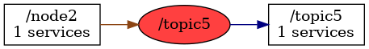

<!--
File was automatically generated using 'ros-diagram-tools' project.
Project is distributed under the BSD 3-Clause license.
-->

## Topic

|  |  |
| --------------------------------- | -------- | ------------ |
| Topic name: | `/topic5` |
| Data type | `xxx3` |
| Publishers: | `/node2` |
| Subscribers: | `/topic5` |

| ROS nodes (2): | Description: |
| ----------------------------------- | ------------ |
| [`/node2`](n__node2.html) | description example |
| [`/topic5`](n__topic5.html) | other important node |

| ROS topics (1): | Description: |
| ----------------------------------- | ------------ |
| [`/topic5`](t__topic5.html) | description of other topic |

 
File was automatically generated using [*ros-diagram-tools*](https://github.com/anetczuk/ros-diagram-tools) project.
Project is distributed under the BSD 3-Clause license.
