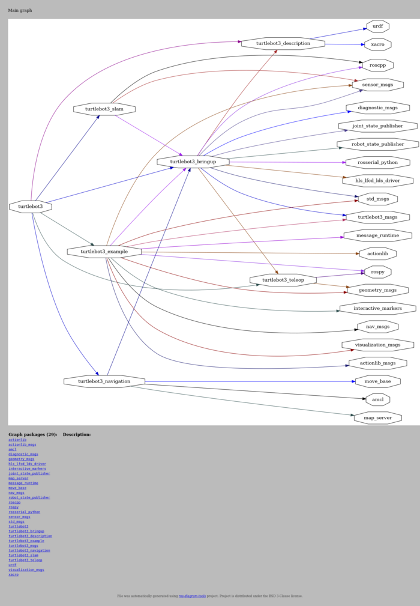
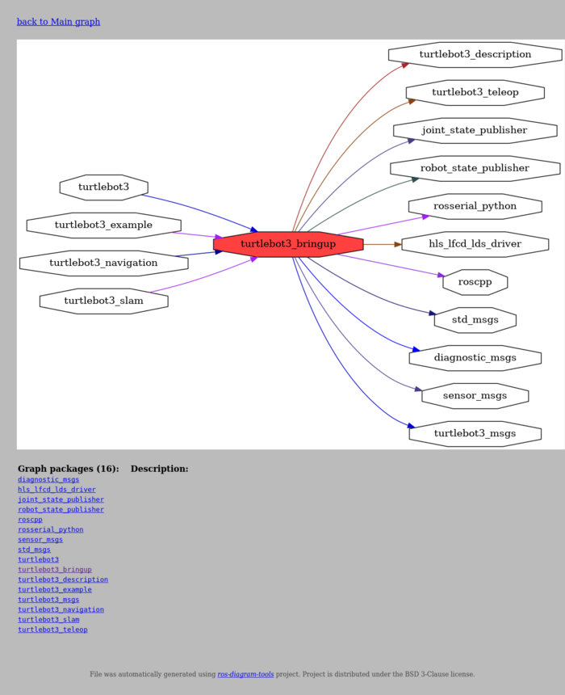
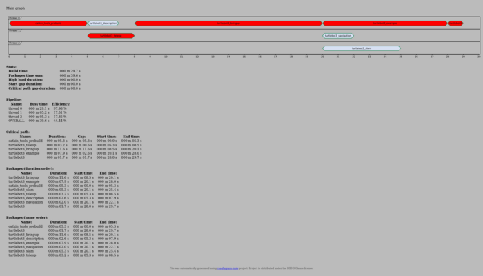

## Example of diagrams over Turtlebot3

*Turtlebot3* project is taken from (https://github.com/ROBOTIS-GIT/turtlebot3) (commit `66681b33749c44e7d9022253ac210ef2da7843a0`).
Project is published on Apache-2.0 license.


### Generation

Dumping required data is done by script `dump.sh`. Script have to be run from environment with installed *ROS*.
Script `generate.sh` generates diagrams and views from duped data.


### Diagrams

#### `codedistribution`

[](out/codedistribution.png)


#### `catkintree`

Generated diagram:

[](out/catkintree/full_graph.png)

Generated main graph view:

[](out/catkintree/main-page.png)

Generated package graph view:

[](out/catkintree/node-page.png)


#### `catkinschedule`

Generated diagram:

[](out/catkinschedule/schedule.png)

Generated main graph view:

[](out/catkinschedule/main-page.png)


#### `rosverify`

```
INFO:rosdiagram.tool.rosverify:found workspaces: ['/home/vbox/rosdiagrams/turtlebot3/catkin_ws', '/opt/ros/noetic']
INFO:rosdiagram.tool.rosverify:all overlay packages: []
INFO:rosdiagram.tool.rosverify:workspace overlay packages: []

```
