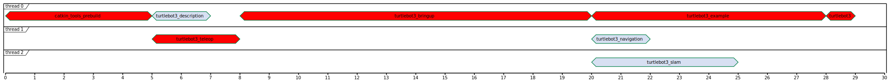

<!--
File was automatically generated using 'ros-diagram-tools' project.
Project is distributed under the BSD 3-Clause license.
-->

## build schedule graph

Stats:
|  |  |
| --- | --- |
| **Build time:** | 000 m 29.7 s |
| **Packages time sum:** | 000 m 39.6 s |
| **High load duration:** | 000 m 00.0 s |
| **Start gap duration:** | 000 m 00.0 s |
| **Critical path gap duration:** | 000 m 00.0 s |

| Name: | Busy time: | Efficiency: |
| --- | --- |
| thread 0 | 000 m 29.1 s | 97.98 %< |
| thread 1 | 000 m 05.2 s | 17.51 %< |
| thread 2 | 000 m 05.3 s | 17.85 %< |
| OVERALL | 000 m 39.6 s | 44.44 %< |

**Critical path:**

| Name: | Duration: | Gap: | Start time: | End time: |
| --- | --- |
| catkin_tools_prebuild | 000 m 05.3 s | 000 m 05.3 s | 000 m 00.0 s | 000 m 05.3 s |
| turtlebot3_teleop | 000 m 03.2 s | 000 m 00.6 s | 000 m 05.3 s | 000 m 08.5 s |
| turtlebot3_bringup | 000 m 11.6 s | 000 m 11.6 s | 000 m 08.5 s | 000 m 20.1 s |
| turtlebot3_example | 000 m 07.9 s | 000 m 02.6 s | 000 m 20.1 s | 000 m 28.0 s |
| turtlebot3 | 000 m 01.7 s | 000 m 01.7 s | 000 m 28.0 s | 000 m 29.7 s |

**Packages (duration order):**

| Name: | Duration: | Start time: | End time: |
| --- | --- |
| turtlebot3_bringup | 000 m 11.6 s | 000 m 08.5 s | 000 m 20.1 s |
| turtlebot3_example | 000 m 07.9 s | 000 m 20.1 s | 000 m 28.0 s |
| catkin_tools_prebuild | 000 m 05.3 s | 000 m 00.0 s | 000 m 05.3 s |
| turtlebot3_slam | 000 m 05.3 s | 000 m 20.1 s | 000 m 25.4 s |
| turtlebot3_teleop | 000 m 03.2 s | 000 m 05.3 s | 000 m 08.5 s |
| turtlebot3_description | 000 m 02.6 s | 000 m 05.3 s | 000 m 07.9 s |
| turtlebot3_navigation | 000 m 02.0 s | 000 m 20.1 s | 000 m 22.1 s |
| turtlebot3 | 000 m 01.7 s | 000 m 28.0 s | 000 m 29.7 s |

**Packages (name order):**

| Name: | Duration: | Start time: | End time: |
| --- | --- |
| catkin_tools_prebuild | 000 m 05.3 s | 000 m 00.0 s | 000 m 05.3 s |
| turtlebot3 | 000 m 01.7 s | 000 m 28.0 s | 000 m 29.7 s |
| turtlebot3_bringup | 000 m 11.6 s | 000 m 08.5 s | 000 m 20.1 s |
| turtlebot3_description | 000 m 02.6 s | 000 m 05.3 s | 000 m 07.9 s |
| turtlebot3_example | 000 m 07.9 s | 000 m 20.1 s | 000 m 28.0 s |
| turtlebot3_navigation | 000 m 02.0 s | 000 m 20.1 s | 000 m 22.1 s |
| turtlebot3_slam | 000 m 05.3 s | 000 m 20.1 s | 000 m 25.4 s |
| turtlebot3_teleop | 000 m 03.2 s | 000 m 05.3 s | 000 m 08.5 s |

 

File was automatically generated using <a href="https://github.com/anetczuk/ros-diagram-tools"><i>ros-diagram-tools</i></a> project.
Project is distributed under the BSD 3-Clause license.

