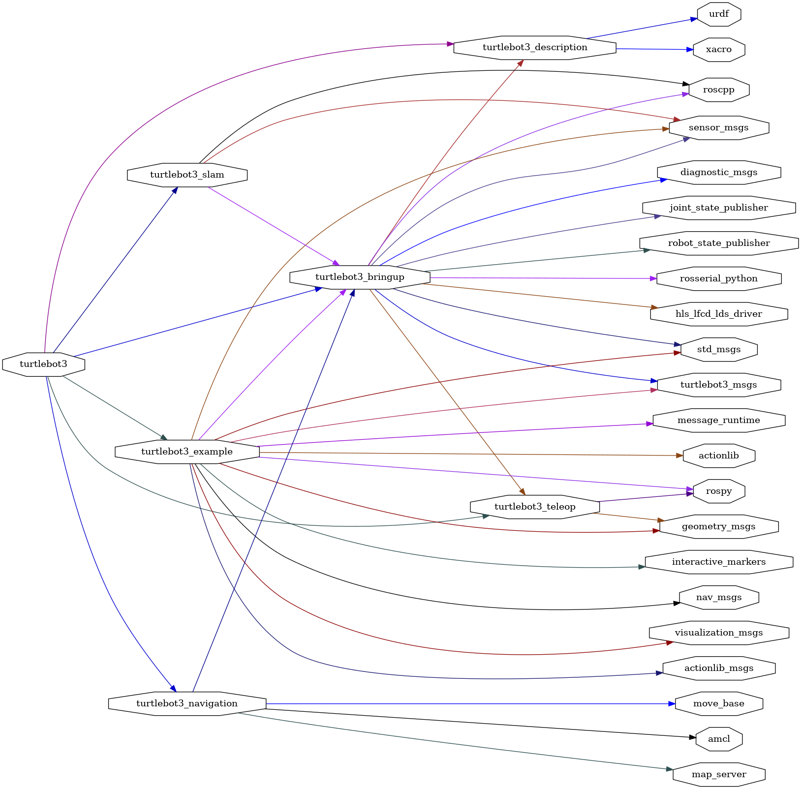

<!--
File was automatically generated using 'ros-diagram-tools' project.
Project is distributed under the BSD 3-Clause license.
-->

## packages graph

| Graph packages (29): | Description: |
| -------------------- | ------------ |
| [`actionlib`](nodes/actionlib.md) |  |
| [`actionlib_msgs`](nodes/actionlib_msgs.md) |  |
| [`amcl`](nodes/amcl.md) |  |
| [`diagnostic_msgs`](nodes/diagnostic_msgs.md) |  |
| [`geometry_msgs`](nodes/geometry_msgs.md) |  |
| [`hls_lfcd_lds_driver`](nodes/hls_lfcd_lds_driver.md) |  |
| [`interactive_markers`](nodes/interactive_markers.md) |  |
| [`joint_state_publisher`](nodes/joint_state_publisher.md) |  |
| [`map_server`](nodes/map_server.md) |  |
| [`message_runtime`](nodes/message_runtime.md) |  |
| [`move_base`](nodes/move_base.md) |  |
| [`nav_msgs`](nodes/nav_msgs.md) |  |
| [`robot_state_publisher`](nodes/robot_state_publisher.md) |  |
| [`roscpp`](nodes/roscpp.md) |  |
| [`rospy`](nodes/rospy.md) |  |
| [`rosserial_python`](nodes/rosserial_python.md) |  |
| [`sensor_msgs`](nodes/sensor_msgs.md) |  |
| [`std_msgs`](nodes/std_msgs.md) |  |
| [`turtlebot3`](nodes/turtlebot3.md) |  |
| [`turtlebot3_bringup`](nodes/turtlebot3_bringup.md) |  |
| [`turtlebot3_description`](nodes/turtlebot3_description.md) |  |
| [`turtlebot3_example`](nodes/turtlebot3_example.md) |  |
| [`turtlebot3_msgs`](nodes/turtlebot3_msgs.md) |  |
| [`turtlebot3_navigation`](nodes/turtlebot3_navigation.md) |  |
| [`turtlebot3_slam`](nodes/turtlebot3_slam.md) |  |
| [`turtlebot3_teleop`](nodes/turtlebot3_teleop.md) |  |
| [`urdf`](nodes/urdf.md) |  |
| [`visualization_msgs`](nodes/visualization_msgs.md) |  |
| [`xacro`](nodes/xacro.md) |  |

 

File was automatically generated using <a href="https://github.com/anetczuk/ros-diagram-tools"><i>ros-diagram-tools</i></a> project.
Project is distributed under the BSD 3-Clause license.

