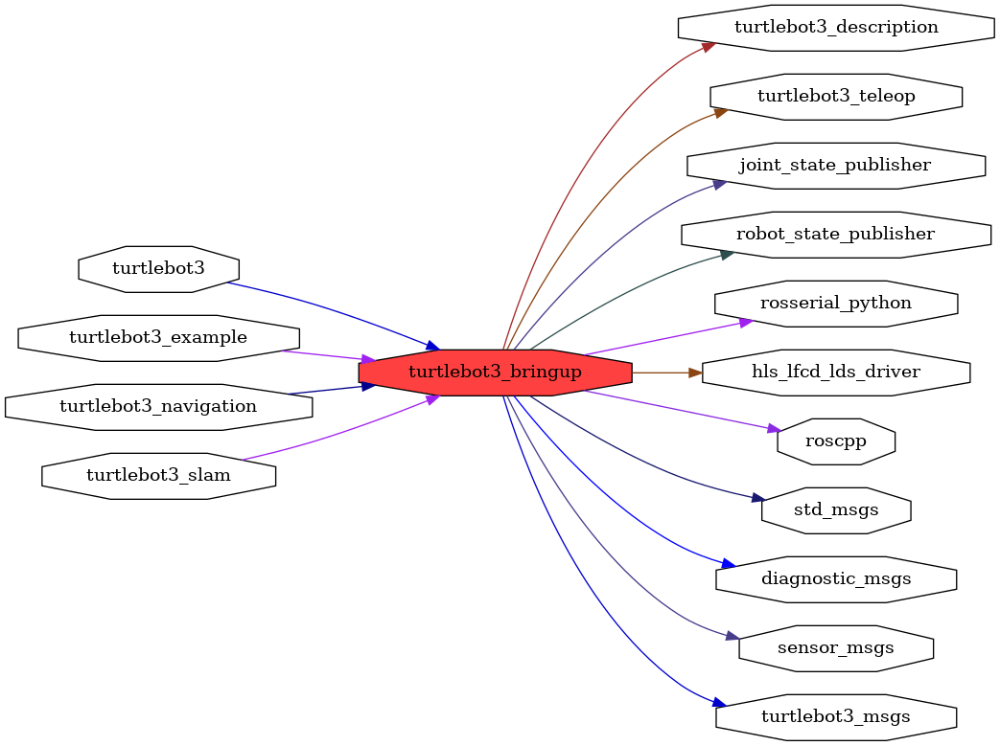

<!--
File was automatically generated using 'ros-diagram-tools' project.
Project is distributed under the BSD 3-Clause license.
-->

## packages graph

| Graph packages (16): | Description: |
| -------------------- | ------------ |
| [`diagnostic_msgs`](diagnostic_msgs.md) |  |
| [`hls_lfcd_lds_driver`](hls_lfcd_lds_driver.md) |  |
| [`joint_state_publisher`](joint_state_publisher.md) |  |
| [`robot_state_publisher`](robot_state_publisher.md) |  |
| [`roscpp`](roscpp.md) |  |
| [`rosserial_python`](rosserial_python.md) |  |
| [`sensor_msgs`](sensor_msgs.md) |  |
| [`std_msgs`](std_msgs.md) |  |
| [`turtlebot3`](turtlebot3.md) |  |
| [`turtlebot3_bringup`](turtlebot3_bringup.md) |  |
| [`turtlebot3_description`](turtlebot3_description.md) |  |
| [`turtlebot3_example`](turtlebot3_example.md) |  |
| [`turtlebot3_msgs`](turtlebot3_msgs.md) |  |
| [`turtlebot3_navigation`](turtlebot3_navigation.md) |  |
| [`turtlebot3_slam`](turtlebot3_slam.md) |  |
| [`turtlebot3_teleop`](turtlebot3_teleop.md) |  |

 

File was automatically generated using <a href="https://github.com/anetczuk/ros-diagram-tools"><i>ros-diagram-tools</i></a> project.
Project is distributed under the BSD 3-Clause license.

