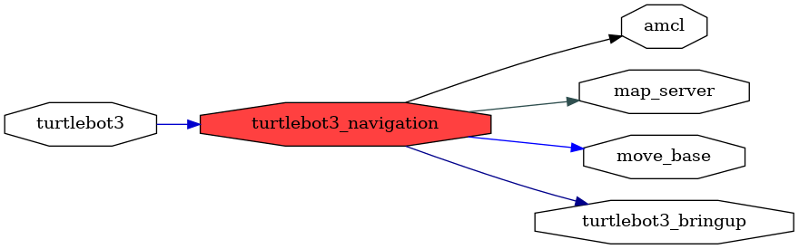

<!--
File was automatically generated using 'ros-diagram-tools' project.
Project is distributed under the BSD 3-Clause license.
-->

## packages graph

| Graph packages (6): | Description: |
| ------------------- | ------------ |
| [`amcl`](amcl.html) |  |
| [`map_server`](map_server.html) |  |
| [`move_base`](move_base.html) |  |
| [`turtlebot3`](turtlebot3.html) |  |
| [`turtlebot3_bringup`](turtlebot3_bringup.html) |  |
| [`turtlebot3_navigation`](turtlebot3_navigation.html) |  |

 

File was automatically generated using <a href="https://github.com/anetczuk/ros-diagram-tools"><i>ros-diagram-tools</i></a> project.
Project is distributed under the BSD 3-Clause license.

