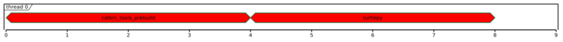
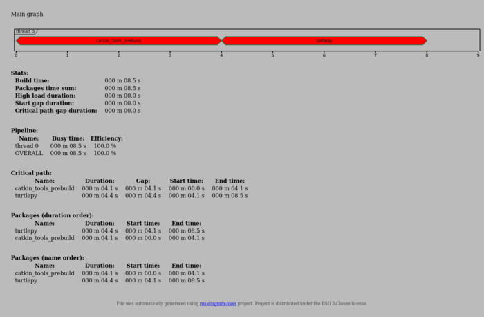
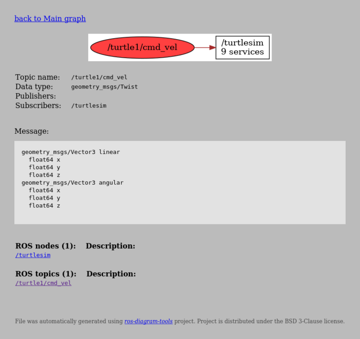
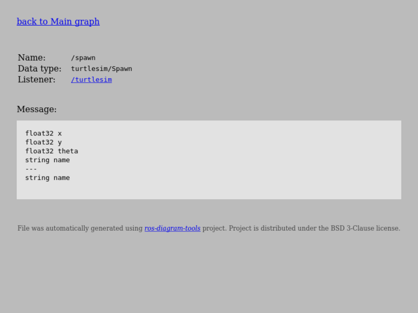

# Example of diagrams over turtlesim

*turtlesim* project is taken from *ROS* repository. Project is published on BSD license.

## Generation

Script `generate-all.sh` generates diagrams and views from duped data.

## `buildtime`

Generated diagram:

Generated main graph view:

## `rosnodegraph`

Generated diagram:

Generated node graph view:

Generated topic graph view:

Generated service graph view:

## `rosbagflow`

Generated node view:

Generated message view:

