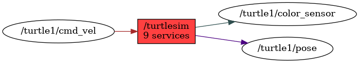

<!--
File was automatically generated using 'ros-diagram-tools' project.
Project is distributed under the BSD 3-Clause license.
-->

## Node

| ROS nodes (1): | Description: |
| ----------------------------------- | ------------ |
| [`/turtlesim`](n__turtlesim.html) |  |

| ROS topics (3): | Description: |
| ----------------------------------- | ------------ |
| [`/turtle1/cmd_vel`](t__turtle1_cmd_vel.html) |  |
| [`/turtle1/color_sensor`](t__turtle1_color_sensor.html) |  |
| [`/turtle1/pose`](t__turtle1_pose.html) |  |

| ROS services (9): | Description: |
| ----------------------------------- | ------------ |
| [`/clear`](s__clear.html) |  |
| [`/kill`](s__kill.html) |  |
| [`/reset`](s__reset.html) |  |
| [`/spawn`](s__spawn.html) |  |
| [`/turtle1/set_pen`](s__turtle1_set_pen.html) |  |
| [`/turtle1/teleport_absolute`](s__turtle1_teleport_absolute.html) |  |
| [`/turtle1/teleport_relative`](s__turtle1_teleport_relative.html) |  |
| [`/turtlesim/get_loggers`](s__turtlesim_get_loggers.html) |  |
| [`/turtlesim/set_logger_level`](s__turtlesim_set_logger_level.html) |  |

    File was automatically generated using [*ros-diagram-tools*]("https://github.com/anetczuk/ros-diagram-tools") project.
    Project is distributed under the BSD 3-Clause license.

