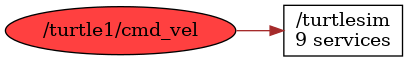

<!--
File was automatically generated using 'ros-diagram-tools' project.
Project is distributed under the BSD 3-Clause license.
-->

## Topic

[](t__turtle1_cmd_vel.png)

|  |  |
| --------------------------------- | -------- | ------------ |
| Topic name: | `/turtle1/cmd_vel` |
| Data type | `geometry_msgs/Twist` |
| Publishers: | `` |
| Subscribers: | `/turtlesim` |

Message:
```
geometry_msgs/Vector3 linear
  float64 x
  float64 y
  float64 z
geometry_msgs/Vector3 angular
  float64 x
  float64 y
  float64 z


```


| ROS nodes (1): | Description: |
| ----------------------------------- | ------------ |
| [`/turtlesim`](n__turtlesim.html) |  |

| ROS topics (1): | Description: |
| ----------------------------------- | ------------ |
| [`/turtle1/cmd_vel`](t__turtle1_cmd_vel.html) |  |


</br>
<font size="1">
File was automatically generated using <a href="https://github.com/anetczuk/ros-diagram-tools"><i>ros-diagram-tools</i></a> project.
Project is distributed under the BSD 3-Clause license.
</font>
