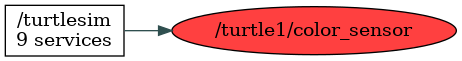

<!--
File was automatically generated using 'ros-diagram-tools' project.
Project is distributed under the BSD 3-Clause license.
-->

## Topic

[](t__turtle1_color_sensor.png)

|  |  |
| --------------------------------- | -------- | ------------ |
| Topic name: | `/turtle1/color_sensor` |
| Data type | `turtlesim/Color` |
| Publishers: | `/turtlesim` |
| Subscribers: | `` |

Message:
```
uint8 r
uint8 g
uint8 b


```


| ROS nodes (1): | Description: |
| ----------------------------------- | ------------ |
| [`/turtlesim`](n__turtlesim.html) |  |

| ROS topics (1): | Description: |
| ----------------------------------- | ------------ |
| [`/turtle1/color_sensor`](t__turtle1_color_sensor.html) |  |


<font size="1">
    File was automatically generated using [*ros-diagram-tools*]("https://github.com/anetczuk/ros-diagram-tools") project.
    Project is distributed under the BSD 3-Clause license.
</font>
